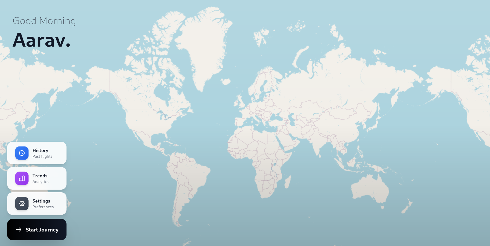
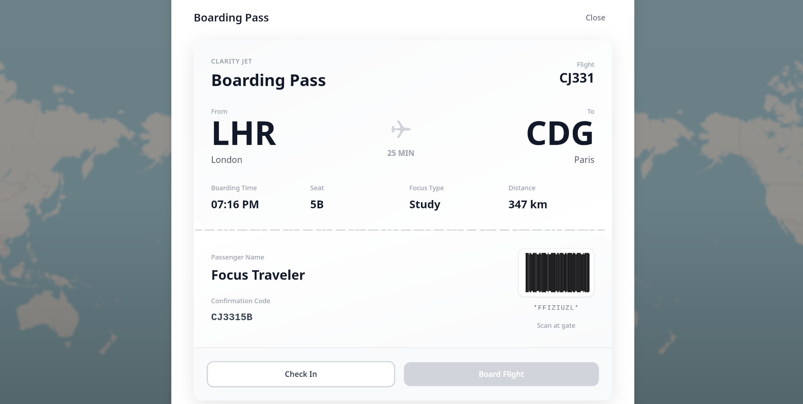
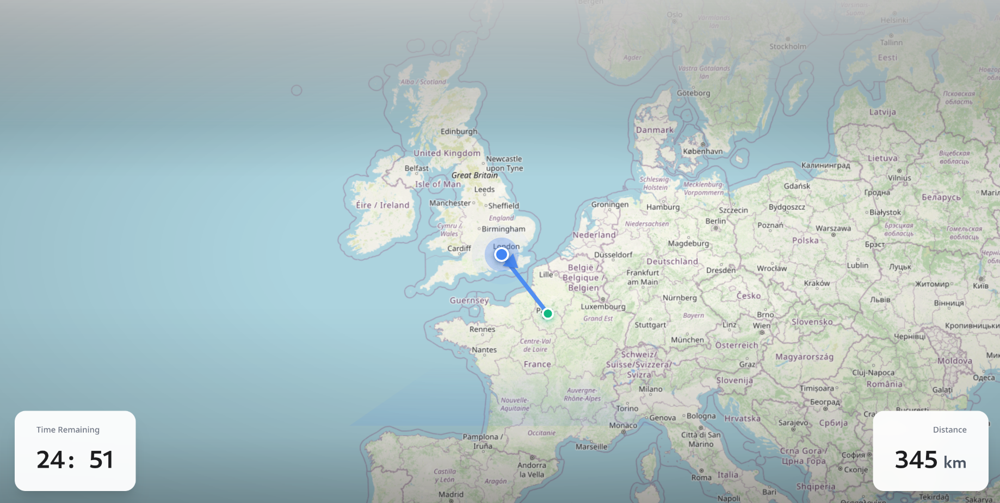

# AirFocus

A desktop focus timer application that transforms deep work into virtual flight journeys. Built with Tauri, React, and TypeScript.

<p align="center">
  
  
  
</p>

## Features

- Book virtual flights between real cities to represent focus sessions
- Track your focus time as miles and distance traveled
- Beautiful airport-inspired UI with realistic boarding passes
- Interactive 3D-style map with Google Maps navigation experience
- Top-down scrollable airplane seat selection
- Session history and focus trends
- Multiple focus modes (Work, Study, Meditate, Read)
- Persistent state across sessions

## Tech Stack

- **Tauri 2.x**: Lightweight desktop application framework
- **React 19**: Modern UI library
- **TypeScript**: Type-safe development
- **Zustand**: State management with localStorage persistence
- **Framer Motion 11**: Smooth 60fps animations
- **Tailwind CSS 3.4**: Utility-first styling with glassmorphism
- **Leaflet + React Leaflet**: Interactive maps with smooth panning
- **OpenStreetMap**: Map tiles for realistic navigation

## Project Structure

```
AirFocus/
  apps/
    desktop/
      src/
        components/
          FocusFlightExperience.tsx  # Main UI component
          AppShell.tsx               # App wrapper
        data/
          cities.ts                  # City database with coordinates
          fake-flights.ts            # Flight route data
        state/
          focus-store.ts             # Zustand store with persistence
        App.tsx                      # Root component
        index.css                    # Global styles + Leaflet customization
      src-tauri/                     # Rust backend
      package.json                   # Frontend dependencies
  .github/
    workflows/
      release.yml                    # Automated release workflow
  package.json                       # Workspace configuration
```

## Installation

1. Clone the repository:

```bash
git clone https://github.com/yourusername/AirFocus.git
cd AirFocus
```

2. Install dependencies:

```bash
npm install
```

3. Run development server:

```bash
npm run dev
```

4. Build production app:

```bash
npm run build
```

## How It Works

1. **Choose Your Flight**: Select from available routes with smaller, cleaner flight cards
2. **Set Duration**: Configure your focus session (5-180 minutes)
3. **Select Your Seat**: Browse a top-down scrollable airplane layout with realistic cabin view
4. **Choose Focus Type**: Select what you want to work on (Work, Study, Meditate, Read)
5. **Boarding Pass**: Review your realistic airport-style boarding pass
6. **Take Flight**: Watch your route progress on an immersive 3D-style map
7. **Land**: Complete your session and earn achievements

## Features in Detail

### Realistic Boarding Pass

- Airport-style design with perforated tear lines
- Flight details grid with all information
- Integrated barcode for scanning
- Professional typography and spacing

### Airplane Seat Selection

- Top-down view of full airplane cabin
- 30 rows with 6 seats per row (180 total seats)
- Cockpit and lavatory sections
- Color-coded availability (Available, Selected, Occupied)
- Smooth scrolling with custom scrollbar

### 3D Navigation Experience

- Google Maps-style blue dot cursor with pulsing rings
- Directional chevron that rotates with movement
- Dynamic route coloring (grey for covered, blue for remaining)
- Smooth 60fps animation using requestAnimationFrame
- 3D perspective overlays for depth perception
- Zoom level optimized for comfortable viewing

## Design System

### Colors

- Background: `#0a0e1a` (dark navy)
- Accent: `#4285f4` (Google blue)
- Glass: White with low opacity + blur
- Map covered route: `#9ca3af` (grey)
- Map remaining route: `#4285f4` (blue)

### Typography

- Font: SF Pro Display, system-ui fallback
- Uppercase tracking for labels
- Bold weights for emphasis

### Effects

- Glassmorphism with backdrop blur
- Smooth 60fps animations
- 3D perspective transforms
- Pulsing rings and glows

## Version History

- **v1.0.0** (2025): Initial release
  - Airport-inspired UI redesign
  - Realistic boarding passes
  - Top-down airplane seating
  - 3D map experience with Google Maps styling
  - Smooth animations and interactions

## Credits

Original concept inspired by FocusFlight for iOS, reimagined with airport authenticity and Google Maps navigation experience.
